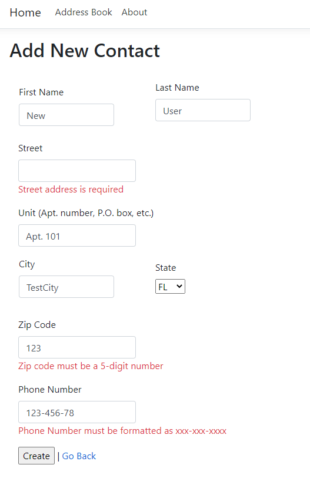

# Address Book
This is an MVC .NET Core application for managing contact information.

## Author
Austin Norden

## Functionality Requested
View, edit, and delete contacts including data below:
* First Name
* Last Name
* Address
* Phone Number

## Technology Used
* .NET Core 3.1
* MVC with Razor
* Entity Framework Core
    * Uses SQL Server LocalDB. Upon execution, ```.mdf``` DB files will be created in the ```C:/Users/<username>``` folder
* Client and Server-side validation

## Notes
This project was my first attempt with using .NET Core, MVC/Razor, and Entity Framework Core. Therefore, I took the opportunity to add extra functionality to get more practice:
* Functionality to create a new contact
* Searching/filtering contacts
* Sortable columns when viewing contacts

There are a couple ```//TODO:``` statements in ```ContactsController.cs```.  I came across some questions regarding the handling of duplicate records when updating/deleting data using Entity Framework

## Screenshots

<br>
*Viewing all contacts*
<br><br>


<br>
*Searching/filtering contacts*
<br><br>


<br>
*Sorting contacts*
<br><br>


<br>
*Adding new contact with validation*
<br><br>


<br>
*Editing existing contact*
<br><br>


<br>
*Deleting contact*
